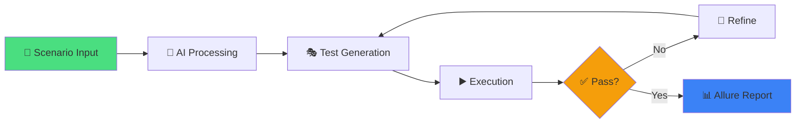

# 🧪 Playwright MCP Automation with Allure Reports

<div align="center">


### 🚀 AI-Powered End-to-End Testing with Visual Reports

*Harness the power of GPT-4.1 to generate, execute, and refine Playwright tests automatically*

[Features](#-features) • [Quick Start](#-quick-start) • [CI/CD](#-cicd-integration) • [Documentation](#-documentation)

</div>

---

## 🌟 Features

<table>
<tr>
<td width="50%">

### 🤖 **AI-Powered Generation**
Leverages GPT-4.1 to create comprehensive end-to-end tests from natural language scenarios and structured context.

### 🔁 **Iterative Workflow**
Tests are automatically generated, executed, and refined until they pass successfully.

### 🧱 **Page Object Model**
Implements scalable POM design pattern for maintainable and reusable test architecture.

</td>
<td width="50%">

### 📊 **Rich Visual Reports**
Integrated Allure Reports provide interactive dashboards with detailed test steps and visualizations.

### 🔧 **CI/CD Ready**
Seamlessly integrates with Jenkins pipelines for automated test execution and report generation.

### 💡 **GitHub Copilot Support**
Enhanced with Copilot Agent Mode for intelligent test debugging and code suggestions.

</td>
</tr>
</table>

---

## 🎯 What Makes This Special?



---

## 🚀 Quick Start

### 📋 Prerequisites

Before you begin, ensure you have the following installed:

| Tool | Version | Purpose |
|------|---------|---------|
| 📦 Node.js | LTS (18+) | Runtime environment |
| 🧶 npm/Yarn | Latest | Package management |
| 💻 VS Code | Latest | IDE with AI extensions |
| 🎭 Playwright | Latest | Browser automation |
| 🧠 GitHub Copilot | Optional | AI-powered assistance |

### ⚡ Installation

**1️⃣ Clone the Repository**
```bash
git clone https://github.com/your-username/playwright-mcp-automation.git
cd playwright-mcp-automation
```

**2️⃣ Install Dependencies**
```bash
npm install
# or
yarn install
```

**3️⃣ Install Playwright Browsers**
```bash
npx playwright install
```

**4️⃣ Install Allure Dependencies**
```bash
npm install -D allure-playwright allure-commandline
```

### ⚙️ Configuration

Update your `playwright.config.ts`:

```typescript
import { defineConfig } from '@playwright/test';

export default defineConfig({
  testDir: './tests',
  reporter: [
    ['list'],
    ['html', { open: 'never' }],
    ['allure-playwright', {
      detail: true,
      outputFolder: 'allure-results',
      suiteTitle: false,
    }],
  ],
  use: {
    trace: 'on-first-retry',
  },
});
```

---

## 🧪 Running Tests

### ▶️ Execute Tests
```bash
npx playwright test
```
*This generates raw test data in the `allure-results/` directory*

### 📊 Generate Allure Report
```bash
npx allure generate allure-results --clean -o allure-report
```

### 🌐 View Interactive Report
```bash
npx allure open allure-report
```

---

## 🤖 AI-Powered Test Generation

### 🧠 How It Works

```
┌─────────────────────────────────────────────────┐
│  1️⃣  Provide Scenario + Test Context           │
│  2️⃣  MCP Tools Inspect & Interact              │
│  3️⃣  Generate Playwright Tests (POM)           │
│  4️⃣  Save to /tests/ & Execute                 │
│  5️⃣  Refine Until Tests Pass ✅                │
└─────────────────────────────────────────────────┘
```

### 💬 Example Prompt

```
Navigate to http://www.automationpractice.pl/index.php
Search for "T-shirts"
Verify "Faded short sleeve T-shirts" is in the results
```

### 🔄 Automated Execution Cycle

1. **Load Context** - MCP loads test requirements and page structures
2. **Generate Steps** - GPT-4.1 creates test steps using POM pattern
3. **Execute** - Test runs automatically with Playwright
4. **Iterate** - AI refines failing tests until success ✅

---

## 💡 Using GitHub Copilot Agent Mode

Supercharge your testing workflow with GitHub Copilot:

### 📦 Setup
1. Install **GitHub Copilot** and **Copilot Chat** extensions in VS Code
2. Enable Agent Mode for autonomous assistance

### 🎯 Powerful Prompts

```
🔹 Generate a Playwright test for login using POM
🔹 Help debug why the test is failing
🔹 Refactor this test to use async/await properly
🔹 Add assertions for error handling
```

Copilot analyzes your context and provides intelligent suggestions and fixes!

---

## 🏗️ CI/CD Integration

### 🔧 Jenkins Setup

#### Prerequisites Checklist
- ✅ Jenkins server running
- ✅ Node.js & npm installed on build agents
- ✅ Playwright browsers configured
- ✅ Allure CLI available

#### 📦 Required Jenkins Plugins

Navigate to **Manage Jenkins → Plugins → Available**:

- ✅ **Allure Jenkins Plugin**
- ✅ **NodeJS Plugin**

#### 🧰 Configure Global Tools

**NodeJS Configuration:**
1. Go to **Manage Jenkins → Global Tool Configuration**
2. Under **NodeJS**, add version (e.g., NodeJS 18)
3. Check "Install automatically"

**Allure CLI Configuration:**
1. Download and unzip [Allure CLI](https://github.com/allure-framework/allure2/releases)
2. Add `bin/` folder to Jenkins agent PATH

#### 🎬 Create Freestyle Job

1. **New Item → Freestyle project**
2. **Name:** `Playwright-E2E-Tests`
3. **Source Code Management:** Git
   - Repository URL: `https://github.com/your-username/your-repo-name.git`
4. **Build Environment:**
   - ✔️ Provide Node & npm bin folder to PATH
   - Select configured NodeJS version
5. **Build Steps** (Execute Shell/Batch):
   ```bash
   npm install
   npx playwright install
   npx playwright test --reporter=line,allure-playwright
   ```
6. **Post-Build Action:** Allure Report
   - Path to results: `allure-results`

### 📊 Jenkins Pipeline (Jenkinsfile)

```groovy
pipeline {
    agent any
    
    tools {
        nodejs 'NodeJS 18' // Match Jenkins Global Tool Configuration
    }
    
    environment {
        // Optional: Add Allure path if installed manually
        PATH = "${env.PATH};C:\\allure-commandline\\bin"
    }
    
    stages {
        stage('📦 Install Dependencies') {
            steps {
                echo 'Installing dependencies...'
                bat 'npm install'
                bat 'npx playwright install'
            }
        }
        
        stage('🧪 Run Playwright Tests') {
            steps {
                echo 'Running Playwright tests with Allure reporter...'
                bat 'npx playwright test --reporter=line,allure-playwright'
            }
        }
        
        stage('📊 Generate Allure Report') {
            steps {
                echo 'Generating Allure HTML Report...'
                bat 'npx allure generate allure-results --clean -o allure-report'
            }
        }
    }
    
    post {
        always {
            echo 'Publishing Allure Report...'
            allure includeProperties: false,
                   jdk: '',
                   reportBuildPolicy: 'ALWAYS',
                   results: [[path: 'allure-results']]
        }
    }
}
```

> **💡 Note:** Use `bat` for Windows agents, `sh` for Linux/macOS agents

### 🚀 Pipeline Setup in Jenkins

1. Create new **Pipeline project**
2. Configure Pipeline:
   - Choose "Pipeline script from SCM"
   - SCM: Git
   - Repository URL: Your GitHub repo
   - Script Path: `Jenkinsfile` (case-sensitive)
3. **Save** and click **Build Now**

---

## ✅ Example Implementation

### 🔍 Test Scenario

**Goal:** Search for a product on automationpractice.pl

**Steps:**
1. 🧭 Navigate to homepage
2. 🔎 Search for "T-shirts"
3. ✅ Validate "Faded short sleeve T-shirts" appears

**Implementation:** Built using Page Object Model with AI-generated test logic

---

## 📁 Project Structure

```
playwright-mcp-automation/
├── 📂 tests/              # Test files (AI-generated)
├── 📂 pages/              # Page Object Models
├── 📂 allure-results/     # Raw test results
├── 📂 allure-report/      # Generated HTML reports
├── 📄 playwright.config.ts
├── 📄 Jenkinsfile
├── 📄 package.json
└── 📄 README.md
```

---

## 📚 Documentation

### 🔗 Useful Resources

| Resource | Link |
|----------|------|
| 🎭 Playwright Docs | [playwright.dev](https://playwright.dev) |
| 📊 Allure Reports | [docs.qameta.io/allure](https://docs.qameta.io/allure) |
| 🤖 GitHub Copilot | [github.com/features/copilot](https://github.com/features/copilot) |
| 🔧 Jenkins | [jenkins.io](https://jenkins.io) |

---

## 🤝 Contributing

Contributions are welcome! Please feel free to submit a Pull Request.

1. Fork the repository
2. Create your feature branch (`git checkout -b feature/AmazingFeature`)
3. Commit your changes (`git commit -m 'Add some AmazingFeature'`)
4. Push to the branch (`git push origin feature/AmazingFeature`)
5. Open a Pull Request

---

## 📄 License

This project is licensed under the MIT License - see the [LICENSE](LICENSE) file for details.

---

## 🙏 Acknowledgments

- 🎭 Playwright Team for the amazing testing framework
- 📊 Allure Framework for beautiful reports
- 🤖 OpenAI for GPT-4.1 capabilities
- 💻 GitHub Copilot for AI-powered assistance

---

<div align="center">

### ⭐ Star this repository if you find it helpful!

**Made with ❤️ and 🤖 AI**

[⬆ Back to Top](#-playwright-mcp-automation-with-allure-reports)

</div>
